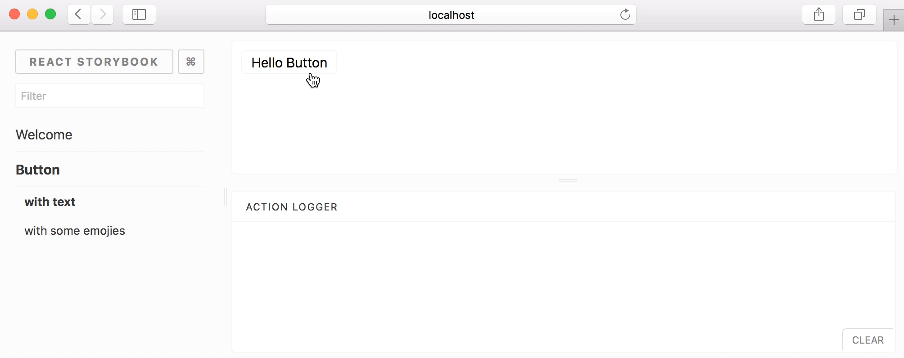

# 插件介绍

默认情况下，Storybook带有列出stories并将其可视化的方法。插件为Storybook实现了额外的功能，以使其更加有用。

基本上，有两种类型的插件。 （装饰器和自带组件）

## 1.装饰器

装饰器是包装story的包装组件或Storybook装饰器。

#### Wrapper Components <a id="wrapper-components"></a>

举例来说，假设我们要居中显示在屏幕上的story。为此，我们可以使用像这样使用包装器组件：

```text
const styles = {
  textAlign: 'center',
};
const Center = ({ children }) => <div style={styles}>{children}</div>;
```

然后我们可以在编写stories时使用它。

```text
import Center from './center';
import Button from './button';

export default {
  title: 'Button',
};

export const defaultView = () => (
  <Center>
    <Button>Hello Button</Button>
  </Center>
);
```

#### Storybook Decorators <a id="storybook-decorators"></a>

您还可以将此功能公开为Storybook装饰器，并按以下方式使用它：

```text
import Button from './button';
import Center from './center';

export default {
  title: 'Button',
  decorators: [storyFn => <Center>{storyFn()}</Center>],
};

export const defaultView = () => (
  <Button>Hello Button</Button>
);
```

您还可以为所有stories全局添加装饰器，如下所示：

in `.storybook/preview.js`:

```text
import { addDecorator } from '@storybook/react';
import Center from './center';

addDecorator(storyFn => <Center>{storyFn()}</Center>);
```

## Native Addons

Native插件将Storybook作为平台并与之交互。Native插件可以添加除包装stories以外的其他功能。

例如，[storybook-actions](https://github.com/storybookjs/storybook/tree/master/addons/actions) 就是这样的插件。



它将允许您检查组件各种事件的参数。

请参阅以下链接以了解有关native插件的更多信息：

* [Using addons](https://storybook.js.org/docs/addons/using-addons)
* [Addon gallery](https://storybook.js.org/addons/)
* [Write your own addon](https://storybook.js.org/docs/addons/writing-addons)

