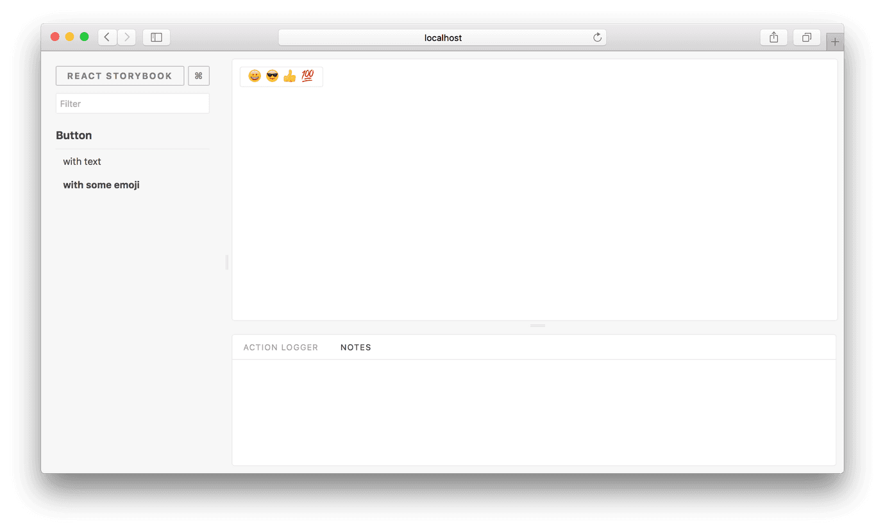
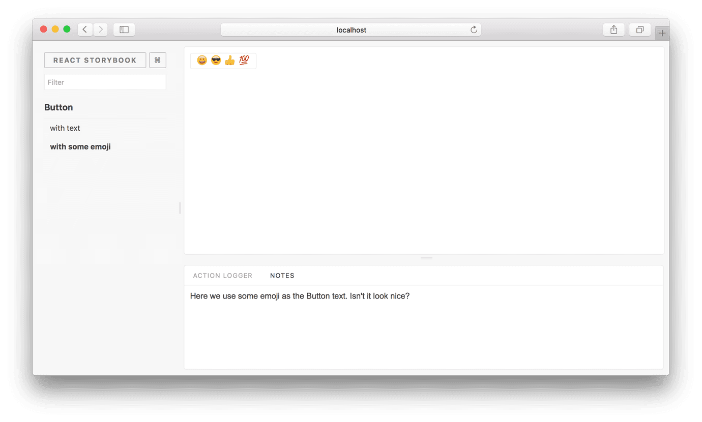

# 使用插件

Storybook附带了与Storybook一起开发和维护的各种“核心”插件。本网站中的大多数示例都使用action和links。但是您可以使用通过NPM分发的任何第三方插件。

我们将使用一个称为Notes的插件。基本上，它使您可以为stories写笔记。

首先，我们需要安装插件：

```text
yarn add -D @storybook/addons @storybook/addon-actions @storybook/addon-knobs @storybook/addon-notes
```

在 `.storybook/main.js` 中 

```text
module.exports = {
  addons: [
    '@storybook/addon-actions/register',
    '@storybook/addon-knobs/register',
    '@storybook/addon-notes/register',
  ],
};
```

创建完成后，您将必须重新启动Storybook以使基础Webpack能够识别插件文件。

这样会注册所有插件，并且您可以在查看story时看到actions和knobs面板（按此顺序）。



## Addons tab order

按它们在main.js文件中的数组中出现的顺序创建选项卡。

## 使用插件

现在，当您编写story时，可以导入actions插件来记录动作。另外，您可以添加notes：

```text
import { action } from '@storybook/addon-actions';
import Button from './Button';

export default {
  title: 'Button',
  component: Button,
};

export const buttonWithEmoji = () => (
  <Button onClick={action('clicked')}>
    <span role="img" aria-label="so cool">
      😀 😎 👍 💯
    </span>
  </Button>
);
buttonWithEmoji.story = {
  parameters: {
    notes: 'A small component',
  },
};
```

然后，您可以在查看story时看到这些笔记。



## 禁用插件

您可以通过添加`disabled`参数来禁用story的插件面板。

```text
import { action } from '@storybook/addon-actions';
import Button from './Button';

export default {
  title: 'Button',
  component: Button,
};

export const buttonWithEmoji = () => (
  <Button onClick={action('clicked')}>
    <span role="img" aria-label="so cool">
      😀 😎 👍 💯
    </span>
  </Button>
);
buttonWithEmoji.story = {
  parameters: {
    notes: { disabled: true }
  }
};

```

## 全局配置

有时，您可能需要全局配置插件，例如将stories与组件并置，或者使story文件更整洁。为此，您可以将装饰器添加到配置文件中，通常在.storybook / preview.js中。这是您可能如何执行此操作的示例。

```text
import { addParameters } from '@storybook/react';

addParameters({
  notes: 'global notes',
});
```

就像这样，您可以安装任何其他插件并使用它。看看我们的插件画廊，发现更多插件。

