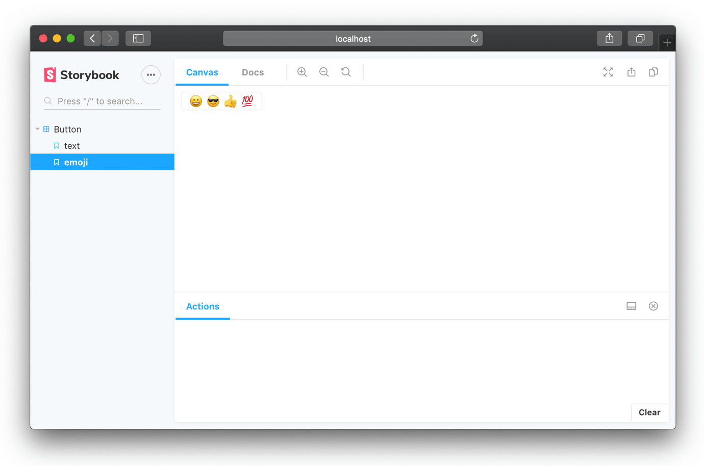

# 编写Stories

Storybook是story的集合。每个story代表组件的单个视觉状态。

> 从技术上来讲，一个story是可以返回渲染到屏幕的内容的函数。

## 基本Story

这是一个`Button`组件stories的例子：

```text
import React from 'react';
import { action } from '@storybook/addon-actions';
import Button from './Button';

export default {
  component: Button,
  title: 'Button',
};

export const text = () => <Button onClick={action('clicked')}>Hello Button</Button>;

export const emoji = () => (
  <Button onClick={action('clicked')}>
    <span role="img" aria-label="so cool">
      😀 😎 👍 💯
    </span>
  </Button>
);
```

你将在Storybook中看到：



命名的导出定义了Button的stories，默认的导出定义了适用于该组的元数据。

本例中，组件是Button。`title`决定了Storybook左侧导航面板中该组的标题，并且应该是唯一的，即不能在文件之间重复使用。在这个示例中，它位于顶层，但通常位于Story层次结构内。

本示例以Storybook的[Component Story Format](../formats/component-story-format.md)（CSF）编写。故事书还支持：

* 经典的StoryOf API，可通过Storybook的API添加stories。
* 一种实验性的MDX语法，它混合了Markdown长格式文档和JSX stories。

由于CSF是Storybook的新增功能，因此您在野外发现的大多数Storybook示例都写入了storyOf API。

此外，React Native的Storybook目前仅支持storyOf格式。React Native将在将来的版本中获得CSF和MDX支持。

## Story文件目录

当Stories与组件并排放置时，它们更易于维护。我们推荐：

└── src 

└── components 

            └── button

                       ├── button.js 

                       └── button.stories.js

由您自己决定适用于您的项目/团队的命名/布置方案。其他命名约定有：

* 组件目录中的storys子目录
* src目录平级的stories目录

## 载入stories

Stories将加载到.storybook / main.js文件或.storybook / preview.js文件中。加载stories的最便捷方法是按文件名。例如，如果您的stories文件位于src / components目录中，则可以使用以下代码段：

```text
// .storybook/main.js
module.exports = {
  stories: ['../src/components/**/*.stories.js'],
};
```

或者，您可以将所有故事导入`.storybook / preview.js`：

```text
import { configure } from '@storybook/react';

configure(require.context('../src/components', true, /\.stories\.js$/), module);
```

> 注意：在`.storybook / preview.js`中，只能调用一次`configure`函数。

`configure` 函数接受:

* 一个`require.context`“ `req`”
* 需要从多个位置加载的`req`数组
* 一个应该返回void或模块导出数组的加载器函数

如果要从多个位置加载，可以使用一个数组：

```text
import { configure } from '@storybook/react';

configure(
  [
    require.context('../src/components', true, /\.stories\.js$/),
    require.context('../lib', true, /\.stories\.js$/),
  ],
  module
);
```

或者，如果您想执行一些自定义的加载逻辑，则可以使用加载器函数。如果您要使用CSF，请记住要返回一个模块导出数组。这是一个强制文件以特定顺序加载的示例。

```text
import { configure } from '@storybook/react';

const loaderFn = () => [
  require('./welcome.stories.js'),
  require('./prelude.stories.js'),
  require('./button.stories.js'),
  require('./input.stories.js'),
];

configure(loaderFn, module);
```

这是另一个将手动加载与全局样式加载混合在一起的示例：

```text
import { configure } from '@storybook/react';

const loaderFn = () => {
  const allExports = [require('./welcome.stories.js')];
  const req = require.context('../src/components', true, /\.stories\.js$/);
  req.keys().forEach(fname => allExports.push(req(fname)));
  return allExports;
};

configure(loaderFn, module);
```

Storybook使用Webpack的require.context动态加载模块。查看相关的Webpack文档，以了解有关如何使用`require.context`的更多信息。

如果您直接使用StoryOf API，或者在无法使用CSF的情况下使用@ storybook / react-native，则应使用没有返回值的加载器函数：

```text
import { configure } from '@storybook/react';

const loaderFn = () => {
  // manual loading
  require('./welcome.stories.js');
  require('./button.stories.js');

  // dynamic loading, unavailable in react-native
  const req = require.context('../src/components', true, /\.stories\.js$/);
  req.keys().forEach(fname => req(fname));
};

configure(loaderFn, module);
```

此外，React Native打包程序会在构建时解析所有导入，因此无法动态加载模块。有一个第三方加载器[react-native-storybook-loader](https://github.com/elderfo/react-native-storybook-loader)可以自动生成所有故事的导入语句。

## 装饰器

装饰器是一种使用一组通用组件包装故事的方法，例如，如果您想以某种格式包装故事或为故事提供一些上下文。

装饰器可以全局，在组件级别或在故事级别单独应用。全局装饰器通常应用在Storybook配置文件中，而Component/Story装饰器则应用在story文件中。

这是一个全局装饰器的示例，该装饰器作用在.storybook / preview.js中的每个故事：

```text
import React from 'react';
import { addDecorator } from '@storybook/react';

addDecorator(storyFn => <div style={{ textAlign: 'center' }}>{storyFn()}</div>);
```

> 在Vue项目中，即使使用JSX，也必须使用特殊组件而不是React项目中使用的函数参数storyFn，例如：
>
> ```text
> var decoratorVueJsx = () => ({ render() { return <div style={{ textAlign: 'center' }}><story/></div>} })
> addDecorator(decoratorVueJsx)
>
> var decoratorVueTemplate = () => ({ template: `<div style="text-align:center"><story/></div>` })
> addDecorator(decoratorVueTemplate)
> ```

这是组件/本地装饰器的示例。组件装饰器将所有故事都包装在一个黄色框架中，而story装饰器将一个story包装在另一个红色框架中。

```text
import React from 'react';
import MyComponent from './MyComponent';

export default {
  title: 'MyComponent',
  decorators: [storyFn => <div style={{ backgroundColor: 'yellow' }}>{storyFn()}</div>],
};

export const normal = () => <MyComponent />;
export const special = () => <MyComponent text="The Boss" />;
special.story = {
  decorators: [storyFn => <div style={{ border: '5px solid red' }}>{storyFn()}</div>],
};

```

装饰器不仅用于story格式设置，而且通常可用于story所需的各种类型的上下文。

* 主题库需要通过上下文来传递主题。与其在每个story中依次定义它，不如添加一个装饰器。
* 同样，状态管理库（例如Redux）通过上下文提供全局Store。
* 最后，Storybook插件大量使用装饰器。例如，Storybook的Knobs插件使用装饰器来修改story的基于UI的输入属性。

## 参数

参数是story的自定义元数据。像装饰器一样，它们也可以分层应用在：全局，组件级或story本地。

这是一个示例，我们借助参数将Markdow变为stories的注释，这些注释将显示在Notes插件中。

我们首先在.storybook / preview.js中全局应用一些注释。

```text
import { load, addParameters } from '@storybook/react';
import defaultNotes from './instructions.md';

addParameters({ notes: defaultNotes });
```

在有些情况下将非常有用，例如，`instructions.md`中含有如何在没有文档的情况下为组件编写说明。

然后，对于已有文档的组件，我们可以在`component/story`级别覆盖它：

```text
import React from 'react';
import MyComponent from './MyComponent';
import componentNotes from './notes.md';
import specialNotes from './special.md';

export default {
  title: 'MyComponent',
  parameters: { notes: componentNotes },
};

export const small = () => <MyComponent text="small" />;
export const medium = () => <MyComponent text="medium" />;
export const special = () => <MyComponent text="The Boss" />;
special.story = {
  parameters: { notes: specialNotes },
};
```

在此示例中，`small`和`medium`将组件注释记录在`notes.md`中（与`instructions.md`中的通用说明相反）。这个`special`story有 一些特别的注释。

## 搜索

默认情况下，搜索结果将根据您stories的文件名显示。从Storybook5开始，您可以在搜索输入包含`notes`中某些匹配项来扩展搜索结果。

例如，如果您还构建了一个希望通过搜索`popover`或`tooltip`来找到`Callout`组件，则可以使用如下`notes`：

```text
export const callout = () => <Callout>Some children</Callout>;
callout.story = {
  parameters: { notes: 'popover tooltip' },
};
```

## Story层次

stories可以使用“ /”作为分隔符以嵌套结构进行组织。

例如，以下代码片段将`Button`和`Checkbox`组件嵌套在`Atoms`组中，位于名为`Design System`的顶级标题下。

```text
// Button.stories.js
import React from 'react';
import Button from './Button';

export default {
  title: 'Design System/Atoms/Button',
};
export const normal = () => <Button onClick={action('clicked')}>Hello Button</Button>;

```

```text
// Checkbox.stories.js
import React from 'react';
import Checkbox from './Checkbox';

export default {
  title: 'Design System/Atoms/Checkbox',
};
export const empty = () => <Checkbox label="empty" />;
export const checked = () => <Checkbox label="checked" checked />;
```

默认情况下，顶级标题将被视为其他任何组，但是如果您希望将其特别强调为“根”，请使用showRoots配置选项。请参阅[配置选项参数](../configurations/options-parameter.md)页面以了解更多信息。

## 根据\_\_dirname生成嵌套路径

嵌套路径可以使用模板文字以编程方式生成，因为story的名字是字符串。

一个示例是使用来自`paths.macro`的`base`：  


```text
import React from 'react';
import base from 'paths.macro';
import BaseButton from '../components/BaseButton';

export default {
  title: `Other/${base}/Dirname Example`,
};
export const story1 = () => <BaseButton label="Story 1" />;
export const story2 = () => <BaseButton label="Story 2" />;
```

_This uses_ [_babel-plugin-macros_](https://github.com/kentcdodds/babel-plugin-macros).

## 运行多个Storybook

通过在启动脚本中指定不同的端口号，可以为单个存储库中的不同种类的stories或组件构建多个Storybook：

```text
{
  "scripts": {
    "start-storybook-for-theme": "start-storybook -p 9001 -c .storybook-theme",
    "start-storybook-for-app": "start-storybook -p 8001 -c .storybook-app"
  }
}
```

## 永久链接到Stories

有时，您可能希望更改story的名称或其在层次结构中的位置，但保留指向该story或其文档的链接，以下是做法：

考虑以下story：

```text
export default {
  title: 'Foo/Bar',
};

export const Baz = () => <MyComponent />;
```

Storybook的ID生成逻辑将为其赋予ID `foo-bar-baz`，因此链接应为`？path = / story / foo-bar-baz`。

现在，假设您要将层次结构中的位置更改为OtherFoo / Bar，并将story名称更改为Moo。方法如下：

```text
export default {
  title: 'OtherFoo/Bar',
  id: 'Foo/Bar', // or 'foo-bar' if you prefer
};

export const Baz = () => <MyComponent />;
Baz.story = {
  name: 'Moo',
};
```

如果提供的话，Storybook会将ID优先于标题，以生成ID，并且将`Story.name`优先显示。


