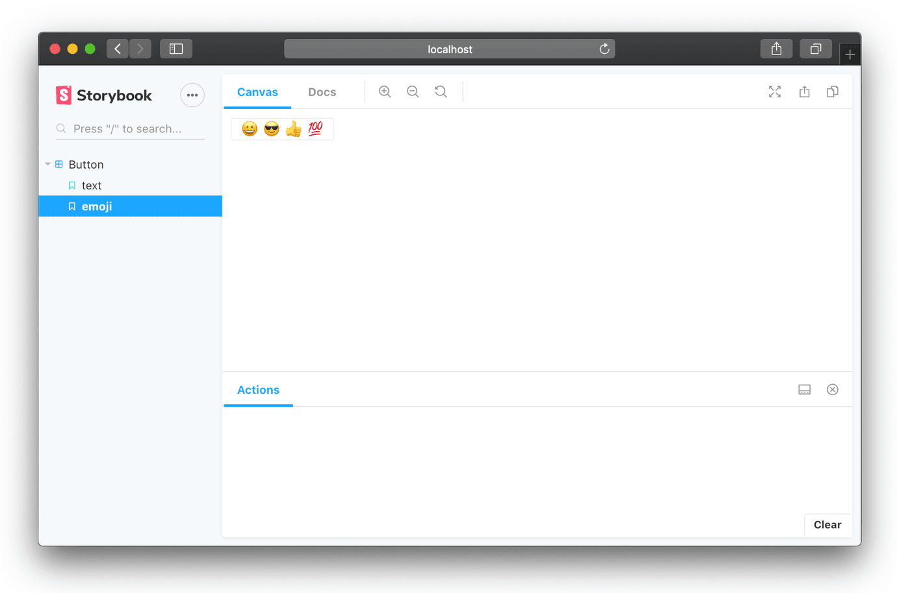

# 介绍

  Storybook 是用户界面开发环境和UI组件的实验场。该工具使开发人员能够独立创建组件，并在隔离的开发环境中以交互方式展示组件。

  Storybook在主应用程序外部运行，因此用户可以独立开发UI组件，而不必担心应用程序特定的依赖关系和要求。

Storybook还支持许多附加组件，并带有一个灵活的API，可以根据需要自定义Storybook。还可以构建Storybook的静态版本，并将其部署到HTTP服务器。

以下是一些精选的故事书，以了解其工作原理：

* [Demo of React Dates](http://airbnb.io/react-dates/) - [source](https://github.com/airbnb/react-dates)
* [Demo of React Native Web](https://necolas.github.io/react-native-web/docs/) - [source](https://github.com/necolas/react-native-web)

阅读“学习Storybook”[教程](https://www.learnstorybook.com/)，以获取有关使用故事书构建应用程序的分步指南，以及了解如何通过隔离构建组件来增强应用程序开发工作流程。

