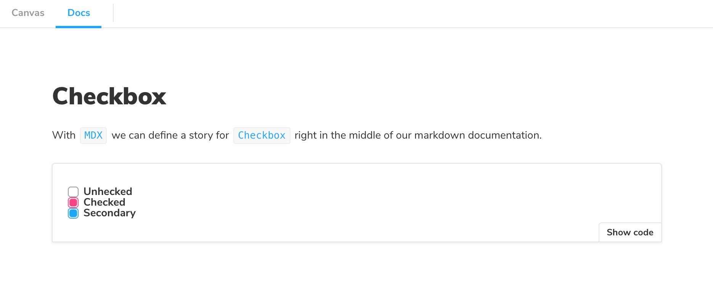
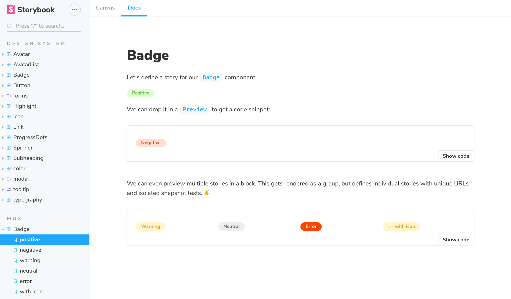
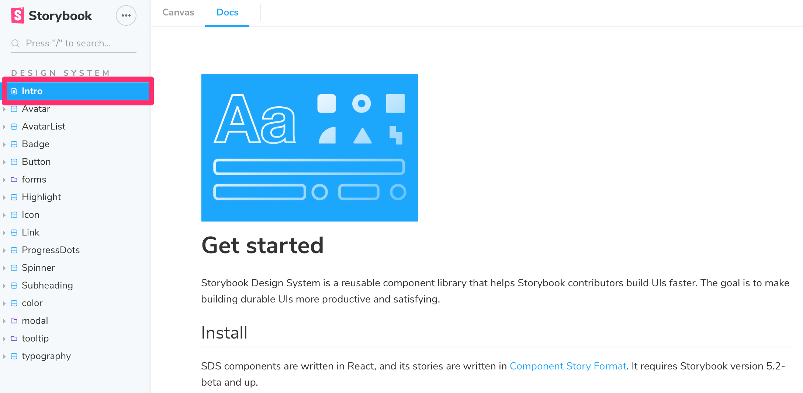

# MDX 语法

MDX是Storybook Docs用于在一个文件中捕获长格式Markdown文档和story的语法。您还可以在MDX中编写纯文档页面，并将它们与您的story一起添加到Storybook中。[阅读该公告](https://medium.com/storybookjs/rich-docs-with-storybook-mdx-61bc145ae7bc)，以了解更多有关其实现方式和来由的信息。

* [Basic example](https://storybook.js.org/docs/formats/mdx-syntax/#basic-example)
* [MDX-Flavored CSF](https://storybook.js.org/docs/formats/mdx-syntax/#mdx-flavored-csf)
* [Writing stories](https://storybook.js.org/docs/formats/mdx-syntax/#writing-stories)
* [Embedding stories](https://storybook.js.org/docs/formats/mdx-syntax/#embedding-stories)
* [Decorators and parameters](https://storybook.js.org/docs/formats/mdx-syntax/#decorators-and-parameters)
* [Documentation-only MDX](https://storybook.js.org/docs/formats/mdx-syntax/#documentation-only-mdx)
* [MDX file names](https://storybook.js.org/docs/formats/mdx-syntax/#mdx-file-names)
* [More resources](https://storybook.js.org/docs/formats/mdx-syntax/#more-resources)

## 基本示例

让我们从结合Markdown和单个story的示例开始：

```text
import { Meta, Story, Preview } from '@storybook/addon-docs/blocks';
import { Checkbox } from './Checkbox';

<Meta title="MDX/Checkbox" component={Checkbox} />

# Checkbox

With `MDX` we can define a story for `Checkbox` right in the middle of our
markdown documentation.

<Preview>
  <Story name="all checkboxes">
    <form>
      <Checkbox id="Unchecked" label="Unchecked" />
      <Checkbox id="Checked" label="Checked" checked />
      <Checkbox appearance="secondary" id="second" label="Secondary" checked />
    </form>
  </Story>
</Preview>
```

这就是在Storybook中的呈现方式：



如您所见，我们正在编写Markdown、JSX，并且还以某种方式定义了与整个Storybook生态系统兼容的stories。

让我们分解一下。

## MDX-Flavored CSF

[MDX](https://mdxjs.com/)是将Markdown与JSX结合在一起的标准文件格式。这意味着您可以在文档中使用Markdown的简洁语法（例如`＃heading`），并在文件中的任意位置自由地嵌入JSX组件块。

MDX风格的CSF包含称为“文档块”的组件集合，这些组件使Storybook可以将MDX文件转换为Storybook stories。MDX定义的stories与常规的Storybook stories相同，因此可以与Storybook的整个附加组件和视图生态系统一起使用。

例如，以下是上面`Checkbox`示例中的story，用CSF重写:

```text
import React from 'react';
import { Checkbox } from './Checkbox';
export default { title: "MDX/Checkbox", component: Checkbox };
export const allCheckboxes = () => (
  <form>
    <Checkbox id="Unchecked" label="Unchecked" />
    <Checkbox id="Checked" label="Checked" checked />
    <Checkbox appearance="secondary" id="second" label="Secondary" checked />
  </form>
);
```

从MDX中的代码到CSF，存在一对一的映射，而映射又直接对应于Storybook内部的API。作为用户，这意味着您现有的Storybook知识应在这三者之间转换。从技术上讲，这意味着在幕后进行的转换是简单且可预测的。

## 编写stories

现在，让我们看一个更现实的示例，看看我们可以做的更多事情：

```text
import { Meta, Story, Preview } from '@storybook/addon-docs/blocks';

import { Badge } from './Badge';
import { Icon } from './Icon';

<Meta title="MDX/Badge" component={Badge} />

# Badge

Let's define a story for our `Badge` component:

<Story name="positive">
  <Badge status="positive">Positive</Badge>
</Story>

We can drop it in a `Preview` to get a code snippet:

<Preview>
  <Story name="negative">
    <Badge status="negative">Negative</Badge>
  </Story>
</Preview>

We can even preview multiple stories in a block. This
gets rendered as a group, but defines individual stories
with unique URLs and isolated snapshot tests.

<Preview>
  <Story name="warning">
    <Badge status="warning">Warning</Badge>
  </Story>
  <Story name="neutral">
    <Badge status="neutral">Neutral</Badge>
  </Story>
  <Story name="error">
    <Badge status="error">Error</Badge>
  </Story>
  <Story name="with icon">
    <Badge status="warning">
      <Icon icon="check" inline />
      with icon
    </Badge>
  </Story>
</Preview>
```

这就是在Storybook中呈现的方式：



## 嵌入stories

假设您已有一个story，并且想要将其嵌入到文档中。以下是显示ID为some-id的story的方法（请查看Storybook v5 +中的浏览器URL以查看story的ID）：

```text
import { Story } from "@storybook/addon-docs/blocks";

# Some header

And markdown here

<Story id="some--id" />
```

您还可以结合使用MDX的其余功能。其中包括source, preview, and prop tables。

## 装饰器和参数

要在MDX中添加装饰器和参数：

```text
<Meta
  title='MyComponent'
  decorators={[ ... ]}
  parameters={{ ... }}
/>

<Story name="story" decorators={[ ... ]} parameters={{ ... }} >
...
</Story>
```

此外，全局装饰器的工作方式与以前一样，例如将以下内容添加到您的`.storybook / preview.js`：

```text
import { addDecorator, addParameters } from '@storybook/react';

addDecorator(...);
addParameters({ ... });
```

## 仅文档的MDX

通常，当您使用Storybook MDX时，您在MDX文档中定义的stories会自动与这些stories相关联。但是，如果您想编写Markdown风格的文档并将其显示在Storybook中怎么办？

如果您未在MDX中定义stories，则可以编写MDX文档并将其与现有story相关联，或将该MDX作为自己的文档节点嵌入到Storybook的导航中。

如果您未定义`Meta`，则可以编写Markdown并将其与现有story关联。请参阅“[带有MDX文档的CSF Stories](https://github.com/storybookjs/storybook/blob/master/addons/docs/docs/recipes.md#csf-stories-with-mdx-docs)”。

要获取“documentation-only story”，请在您的UI中像往常一样定义，但不要定义任何stories。它将作为文档节点显示在您的UI中：



## MDX文件名

除非您使用自定义Webpack配置，否则所有MDX文件都应带有后缀`* .stories.mdx`这告诉Storybook将其文件中的`<Meta>`和`<Story>`元素特殊处理。请确保按照addon-docs安装说明更新您的Storybook配置文件以加载.stories.mdx stories。

